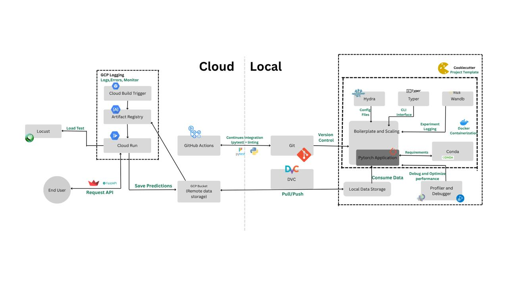

# 🌟 Food Segmentation Model


> **Delicious pixels, smartly segmented!** Welcome to the lively repository of our Food Segmentation project! This end-to-end machine learning project segments food items from images with precision, offers an interactive API, and a gorgeous frontend to boot.

---

## 🚀 Project Overview

This project is a production-ready, MLOps-enabled food segmentation model built using a [cookie-cutter MLOps template](https://github.com/kkkamur07/cookie-cutter). It:

* Segments food items from images using deep learning
* Deploys a FastAPI / BentoML backend
* Serves predictions on a Streamlit frontend

---

##  Project Structure

```
k-kamur07-food103seg-calories/
├── configs/               # Configs for models, datasets, sweeps
├── src/
│   ├── app/              # FastAPI, BentoML, Streamlit
│   ├── segmentation/     # Core training logic
│   └── tests/            # Unit & integration tests
├── saved/                # DVC-tracked model weights
├── notebooks/            # Jupyter notebooks for experiments
├── report/               # Report, figures, results
├── .github/              # CI/CD pipelines (GitHub Actions)
├── Dockerfile.*, docker-compose.yml  # Containerization
├── data.dvc              # Data tracking
├── wandb_runner.py       # W&B experiment runner
├── tasks.py              # Automation CLI (Invoke)
├── pyproject.toml        # Python project metadata + build system
└── README.md             # You're here
```

---

## 🌐 Live Demo

> Try out the live app: [Streamlit App 🔗](https://segmentation-frontend-289925381630.us-central1.run.app/)

Upload your favorite food pic and see it segmented live!

---

## 🧵 How It Works

1. **Model Training**

   * We trained a **UNet** model using our `Food103Seg` dataset
   * The dataset contains **104 food classes**
   * Images are preprocessed and fed into the UNet model
   * Trained model is versioned using **DVC** and exported via FastAPI

2. **API Development**

   * FastAPI / BentoML serves the model
   * Predict endpoint handles image uploads and returns segmentation masks

3. **Frontend**

   * Streamlit UI lets users upload images and see segmented output in real time

4. **Docs & CI/CD**

   * MkDocs auto-generates documentation
   * GitHub Actions handle CI/CD workflows
   * DVC handles data and model versioning across development cycles

---

## 🚧 Installation

```bash
git clone https://github.com/kkkamur07/food103seg-calories
cd food103seg-calories
```

To run API:
```bash
uvicorn src.app.api:app --host 0.0.0.0 --port 8000 --reload
```

To run frontend:
```bash
streamlit run src/app/frontend.py
```

---

## 📊 Model Results

| Metric         | Value          |
| -------------- | -------------- |
| Accuracy       | 65%            |
| Inference Time | 100ms/image    |
| Classes        | 104 food items |


---

## 📑 Documentation

Full API and usage documentation available at: [Documentation](https://kkkamur07.github.io/food103seg-calories/)

---

## 🛠️ Tech Stack

* **Backend**: FastAPI, BentoML
* **Frontend**: Streamlit
* **Model**: UNet (PyTorch)
* **Dataset**: Food103Seg (104 classes)
* **MLOps**: Cookie-cutter template, Docker, GitHub Actions, **DVC**, GCP
* **Docs**: MkDocs

---

## ✅ CI/CD & Versioning

* **GitHub Actions** for automated testing and deployment
* **DVC** for tracking datasets and model files
* **Docker** for consistent environments across development and production
* **Pre-commit** hooks for code quality
* **W\&B** for experiment tracking and sweeping

---

## 🛂 Project Architecture



This architecture represents the full pipeline:

* **Local Side**: Code versioning (Git), data/model tracking (DVC), PyTorch app orchestration via Hydra & Typer, debugging/profiling, and W\&B logging.

* **Cloud Side**: CI/CD via GitHub Actions → GCP Build → Docker artifact → Cloud Run hosting.

* **API & Load Test**: FastAPI app is hosted on Cloud Run, exposed to the end-user. Locust performs load testing.

* **Monitoring**: GCP Logging tracks logs, errors, and performance.

* **Prediction Flow**: End-user hits API → Prediction → Stored in GCP Bucket.

---


