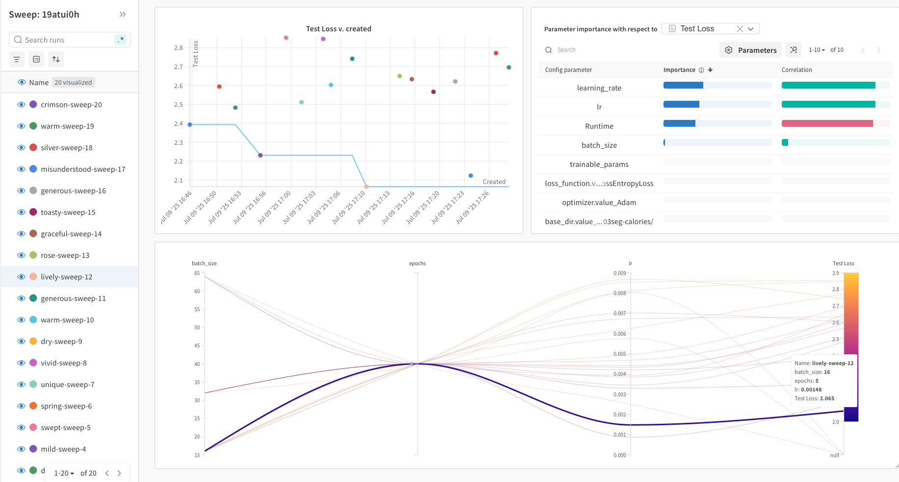
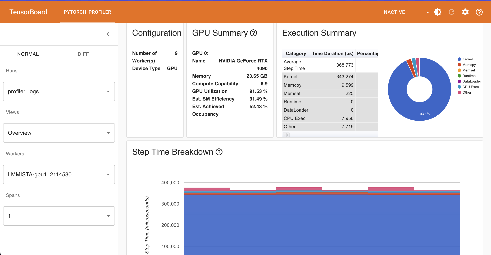
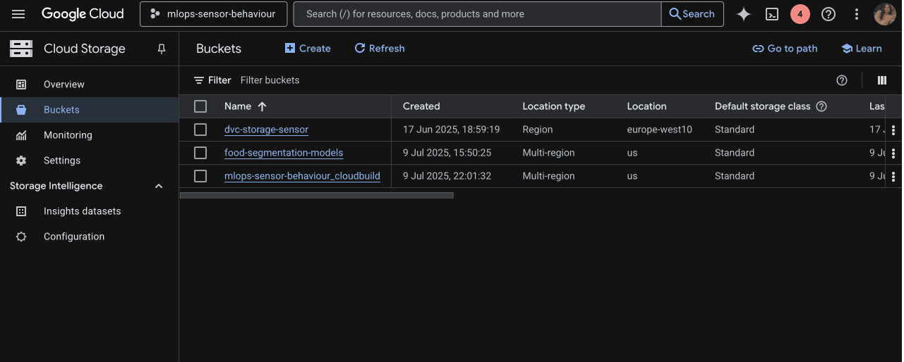

# Exam template for 02476 Machine Learning Operations

This is the report template for the exam. Please only remove the text formatted as with three dashes in front and behind
like:

```--- question 1 fill here ---```

Where you instead should add your answers. Any other changes may have unwanted consequences when your report is
auto-generated at the end of the course. For questions where you are asked to include images, start by adding the image
to the `figures` subfolder (please only use `.png`, `.jpg` or `.jpeg`) and then add the following code in your answer:

``

In addition to this markdown file, we also provide the `report.py` script that provides two utility functions:

Running:

```bash
python report.py html
```

Will generate a `.html` page of your report. After the deadline for answering this template, we will auto-scrape
everything in this `reports` folder and then use this utility to generate a `.html` page that will be your serve
as your final hand-in.

Running

```bash
python report.py check
```

Will check your answers in this template against the constraints listed for each question e.g. is your answer too
short, too long, or have you included an image when asked. For both functions to work you mustn't rename anything.
The script has two dependencies that can be installed with

```bash
pip install typer markdown
```

## Overall project checklist

The checklist is *exhaustive* which means that it includes everything that you could do on the project included in the
curriculum in this course. Therefore, we do not expect at all that you have checked all boxes at the end of the project.
The parenthesis at the end indicates what module the bullet point is related to. Please be honest in your answers, we
will check the repositories and the code to verify your answers.

### Week 1

* [✅] Create a git repository (M5)
* [✅] Make sure that all team members have write access to the GitHub repository (M5)
* [✅] Create a dedicated environment for you project to keep track of your packages (M2)
* [✅] Create the initial file structure using cookiecutter with an appropriate template (M6)
* [✅] Fill out the `data.py` file such that it downloads whatever data you need and preprocesses it (if necessary) (M6)
* [✅] Add a model to `model.py` and a training procedure to `train.py` and get that running (M6)
* [✅] Remember to fill out the `requirements.txt` and `requirements_dev.txt` file with whatever dependencies that you
    are using (M2+M6)
* [✅] Remember to comply with good coding practices (`pep8`) while doing the project (M7)
* [✅] Do a bit of code typing and remember to document essential parts of your code (M7)
* [✅] Setup version control for your data or part of your data (M8)
* [✅] Add command line interfaces and project commands to your code where it makes sense (M9)
* [✅] Construct one or multiple docker files for your code (M10)
* [✅] Build the docker files locally and make sure they work as intended (M10)
* [✅] Write one or multiple configurations files for your experiments (M11)
* [✅] Used Hydra to load the configurations and manage your hyperparameters (M11)
* [✅] Use profiling to optimize your code (M12)
* [✅] Use logging to log important events in your code (M14)
* [✅] Use Weights & Biases to log training progress and other important metrics/artifacts in your code (M14)
* [✅] Consider running a hyperparameter optimization sweep (M14)
* [ ] Use PyTorch-lightning (if applicable) to reduce the amount of boilerplate in your code (M15)

### Week 2

* [✅] Write unit tests related to the data part of your code (M16)
* [✅] Write unit tests related to model construction and or model training (M16)
* [✅] Calculate the code coverage (M16)
* [✅] Get some continuous integration running on the GitHub repository (M17)
* [✅] Add caching and multi-os/python/pytorch testing to your continuous integration (M17)
* [✅] Add a linting step to your continuous integration (M17)
* [✅] Add pre-commit hooks to your version control setup (M18)
* [✅] Add a continues workflow that triggers when data changes (M19)
* [✅] Add a continues workflow that triggers when changes to the model registry is made (M19)
* [✅] Create a data storage in GCP Bucket for your data and link this with your data version control setup (M21)
* [✅] Create a trigger workflow for automatically building your docker images (M21)
* [] Get your model training in GCP using either the Engine or Vertex AI (M21) -> *Not enough credits for the same.*
* [✅] Create a FastAPI application that can do inference using your model (M22)
* [✅] Deploy your model in GCP using either Functions or Run as the backend (M23)
* [✅] Write API tests for your application and setup continues integration for these (M24)
* [✅] Load test your application (M24)
* [✅] Create a more specialized ML-deployment API using either ONNX or BentoML, or both (M25)
* [✅] Create a frontend for your API (M26)

### Week 3

* [ ] Check how robust your model is towards data drifting (M27)
* [ ] Deploy to the cloud a drift detection API (M27)
* [✅] Instrument your API with a couple of system metrics (M28)
* [✅] Setup cloud monitoring of your instrumented application (M28)
* [✅] Create one or more alert systems in GCP to alert you if your app is not behaving correctly (M28)
* [✅] If applicable, optimize the performance of your data loading using distributed data loading (M29)
* [✅] If applicable, optimize the performance of your training pipeline by using distributed training (M30)
* [✅] Play around with quantization, compilation and pruning for you trained models to increase inference speed (M31)

### Extra

* [✅] Write some documentation for your application (M32)
* [✅] Publish the documentation to GitHub Pages (M32) -> [Link](https://kkkamur07.github.io/food103seg-calories/)
* [✅] Revisit your initial project description. Did the project turn out as you wanted? -> Yes
* [✅] Create an architectural diagram over your MLOps pipeline
* [✅] Make sure all group members have an understanding about all parts of the project
* [✅] Uploaded all your code to GitHub

## Group information

### Question 1
> **Enter the group number you signed up on**
>
> Answer:

krrish.agarwalla@campus.lmu.de <br>
alisha.al@campus.lmu.de <br>
astha.gupta@campus.lmu.de <br>
akshata.lokhade@campus.lmu.de <br>

### Question 2
> **Enter the study number for each member in the group**
>
> Answer:

Krrish Agarwalla : 12934480 <br>
Alisha : 13023958 <br>
Astha Gupta : 13021609 <br>
Akshata Lokhade : 13032143 <br>

### Question 3
> **A requirement to the project is that you include a third-party package not covered in the course. What framework**
> **did you choose to work with and did it help you complete the project?**
>
> Answer:

We used the third-party package **uv** to optimize our Docker image building process and speed up package installation times in our project. With uv, dependency resolution and installation became significantly faster, which improved our development workflow and reduced the time needed to rebuild Docker containers. Also with **uv** we are able to make our dependency resolution much faster thus making our code more reproducible.

Initially, we also planned to use the **transformers** package from Hugging Face to leverage pre-trained models for the image segmentation component of our project. However, after implementing and evaluating our own MiniUNET model, we found that it performed efficiently and met our requirements with lightweight computation. As a result, we did not end up integrating transformers.

Overall, using uv provided tangible benefits in streamlining our project’s infrastructure, even though our primary modeling objectives were achieved with a custom, lighter approach.


## Coding environment

> In the following section we are interested in learning more about you local development environment. This includes
> how you managed dependencies, the structure of your code and how you managed code quality.

### Question 4

> **Explain how you managed dependencies in your project? Explain the process a new team member would have to go**
> **through to get an exact copy of your environment.**
>
> Recommended answer length: 100-200 words
>
> Answer:

We managed project dependencies using both **uv** and **pip**. For uv, all core dependencies are specified in the `pyproject.toml` file, ensuring precise and reproducible installations using uv’s fast resolver. For pip users, we maintained `requirements.txt` for production dependencies and `requirements_dev.txt` for development-specific packages. This approach provided flexibility, allowing contributors to install dependencies using either tool depending on their workflow preferences.

To set up an exact copy of the development environment, a new team member can:

**Option 1: Use uv**
  - Clone the project repository.
  - Run `uv pip sync` to install dependencies as specified in `pyproject.toml`.

**Option 2: Use pip**
  - Clone the repository.
  - Run `pip install -r requirements.txt` for core dependencies.

**Option 3: Use Docker Compose**
  - Run the provided `docker-compose.yml` to automatically set up both the backend and frontend, with all dependencies and models pulled and configured.

Full installation steps and environment setup guidance are provided in our project [Documentation](https://kkkamur07.github.io/food103seg-calories/installation/). This ensures new team members can quickly replicate the exact development environment with minimal setup overhead.


### Question 5

> **We expect that you initialized your project using the cookiecutter template. Explain the overall structure of your**
> **code. What did you fill out? Did you deviate from the template in some way?**
>
> Recommended answer length: 100-200 words
>
> Example:
> *From the cookiecutter template we have filled out the ... , ... and ... folder. We have removed the ... folder*
> *because we did not use any ... in our project. We have added an ... folder that contains ... for running our*
> *experiments.*
>
> Answer:

We initialized our project using a **custom Cookiecutter template**, assembled from several open-source templates (including the course-provided one) to fit our MLOps workflow. The structure largely follows standard Cookiecutter conventions introduced in the course, but we introduced key changes for better experiment management and clarity.

Most notably, we added a **saved/** directory to store important model outputs—such as weights, logs, and visualizations—which makes tracking experiments and results straightforward. In the **src/** folder, we created an **app/** subfolder to house API (`service.py`) and frontend (`frontend.py`) code, keeping them separate from core modeling and training logic (**segmentation/**) and from tests.

Other files include DVC and cloud build configs, Dockerfiles for both the backend and frontend, automation scripts, and well-organized configuration in **configs/**. CI/CD pipelines and pre-commit checks are set up via GitHub Actions.

These modifications make the project easier to manage, modular, and collaborative. Our customized template is available at [https://github.com/kkkamur07/cookie-cutter/tree/main/mlops/].


### Question 6

> **Did you implement any rules for code quality and format? What about typing and documentation? Additionally,**
> **explain with your own words why these concepts matters in larger projects.**
>
> Recommended answer length: 100-200 words.
>
>
> Answer:

We implemented **pre-commit hooks** and used **ruff** for linting to ensure our code followed consistent style and quality guidelines. At first, adapting to these rules was a challenge, but we realized that maintaining formatting and linting standards helps keep our codebase organized and easier to read as the project grows. We also used **type hints** in our Python code, which made the functions and modules clearer to understand and enabled type checking tools to catch mistakes early. For documentation, we made sure to write docstrings for key functions and modules, helping both current and future team members understand the code’s purpose and usage.


## Version control

> In the following section we are interested in how version control was used in your project during development to
> corporate and increase the quality of your code.

### Question 7

> **How many tests did you implement and what are they testing in your code?**
>
> Recommended answer length: 50-100 words.
>
> Example:
> *In total we have implemented X tests. Primarily we are testing ... and ... as these the most critical parts of our*
> *application but also ... .*
>
> Answer:
In total, we have implemented 14 tests. We are primarily testing three critical aspects of the application:

Data Pipeline: Ensuring correct loading and batching of data.

Model Architecture: Verifying the neural network's structure, initialization, and forward pass output.

Training Process: Confirming the end-to-end training loop's execution, logging with Weights & Biases, model saving, and visualization of metrics and predictions.

These tests collectively ensure the robustness and correctness of our machine learning pipeline's core components.
--- question 7 fill here ---

### Question 8

> **What is the total code coverage (in percentage) of your code? If your code had a code coverage of 100% (or close**
> **to), would you still trust it to be error free? Explain you reasoning.**
>
> Recommended answer length: 100-200 words.
>
> Example:
> *The total code coverage of code is X%, which includes all our source code. We are far from 100% coverage of our **
> *code and even if we were then...*
>
> Answer:

The overall code coverage of our project is around 61%.Below is the code coverage breakdown for each module:
(foodenv) krrish@LMMISTA-gpu1:~/home/desktop/sarengeyo/food103seg-calories$ coverage report
Name                           Stmts   Miss  Cover
--------------------------------------------------
src/segmentation/__init__.py       0      0   100%
src/segmentation/data.py          38      0   100%
src/segmentation/main.py          50     30    40%
src/segmentation/model.py         36      0   100%
src/segmentation/train.py        255    115    55%
--------------------------------------------------
TOTAL                            379    145    61%

Even if the code coverage were 100%, we still cannot ensure that the code is free from logical or mathematical errors.Code coverage reflects the percentage of code run by tests but does not guarantee that the implementation is correct or that all edge cases are handled properly. Bugs may still exist due to incorrect logic, faulty assumptions, or unexpected data inputs.

To improve the reliability of our code beyond, we have implemented assert statements throughout our test cases. These assertions help us verify the shape and size of tensors.

### Question 9

> **Did you workflow include using branches and pull requests? If yes, explain how. If not, explain how branches and**
> **pull request can help improve version control.**
>
> Recommended answer length: 100-200 words.
>
> Example:
> *We made use of both branches and PRs in our project. In our group, each member had an branch that they worked on in*
> *addition to the main branch. To merge code we ...*
>
> Answer:

We used **Git extensively** throughout our workflow. Each team member worked on their own **feature/teammate_branch**, which allowed everyone to develop and test new features separately without affecting the main codebase. Even small changes were committed regularly to these individual branches. When ready, we would create a **pull request (PR)** and all team members would review the proposed changes. Only after everyone had reviewed, discussed, and understood the updates was the PR merged into the main branch. Whenever someone started working, they made sure to first **pull the latest changes from the main branch** to stay up to date and avoid unnecessary merge conflicts. While we occasionally ran into fatal errors, using branches and PRs significantly helped us maintain code quality, shared understanding, and allowed us to easily manage version control as a team.


### Question 10

> **Did you use DVC for managing data in your project? If yes, then how did it improve your project to have version**
> **control of your data. If no, explain a case where it would be beneficial to have version control of your data.**
>
> Recommended answer length: 100-200 words.
>
> Example:
> *We did make use of DVC in the following way: ... . In the end it helped us in ... for controlling ... part of our*
> *pipeline*
>
> Answer:

We leveraged **DVC (Data Version Control)** extensively to manage both our datasets and model weights throughout the project. DVC streamlined collaboration by enabling team members to easily share and stay synchronized on large datasets and data preprocessing steps—any updates, such as converting images to tensors, could be versioned and seamlessly pulled by others. We also used DVC to track evolving model weights, which helped us manage different checkpoints and ensure full reproducibility independently of external experiment tracking platforms.

While DVC can be integrated with GitHub workflows to automate retraining when data changes, this level of automation wasn’t essential for our current use case. Instead, our CI/CD setup focused on **automatic Docker deployments** that included the latest updated models. Our entire approach and lessons learned with DVC are thoroughly documented in our [project documentation](https://kkkamur07.github.io/food103seg-calories/source/data/).


### Question 11

> **Discuss you continuous integration setup. What kind of continuous integration are you running (unittesting,**
> **linting, etc.)? Do you test multiple operating systems, Python  version etc. Do you make use of caching? Feel free**
> **to insert a link to one of your GitHub actions workflow.**
>
> Recommended answer length: 200-300 words.
>
>
> Answer:

Our project employs a decent CI/CD pipeline leveraging GitHub Actions and Google Cloud Build to streamline testing, linting, and deployment. The core CI workflow automatically runs unit tests using pytest and code linting with ruff on every commit or pull request. This helps maintain code quality and consistency while catching issues early, we have around 14 tests covering everything from data to training. We test across multiple operating systems (Ubuntu, macOS) and Python versions to ensure cross-platform compatibility. To speed up build times, pip caching is used for Python dependencies in the github workflows though locally & in cloud we are using uv to speed up the dependency resolution process. Although DVC is integrated into the pipeline to track data and model file changes (e.g., data.dvc, models.dvc), we found it unnecessary in our case, as the dataset remained static throughout development, but we used DVC extensively to build docker containers on cloud if there is change in model weights and biases. For deployments, we use with Google Cloud Build, which automatically builds Docker images when data updates or new commits land on the main branch. These images are deployed to Cloud Run, eliminating the need for time-consuming local builds and ensuring production readiness.

[ci.yml](https://github.com/kkkamur07/food103seg-calories/blob/main/.github/workflows/ci.yml)
[cloudbuild.yaml](https://github.com/kkkamur07/food103seg-calories/blob/main/cloudbuild.yaml)

## Running code and tracking experiments

> In the following section we are interested in learning more about the experimental setup for running your code and
> especially the reproducibility of your experiments.

### Question 12

> **How did you configure experiments? Did you make use of config files? Explain with coding examples of how you would**
> **run a experiment.**
>
> Recommended answer length: 50-100 words.
>
> Example:
> *We used a simple argparser, that worked in the following way: Python  my_script.py --lr 1e-3 --batch_size 25*
>
> Answer:

We used Hydra for configuration management in our experiments. All key settings—including hyperparameters, WandB sweep parameters, and profiling options—are defined in a central config.yaml file. This makes it easy to manage and modify configurations without changing the main training or model code, promoting a clean, modular, and reproducible setup.

If we need to override any parameter for a specific run, we can do so directly from the command line using Hydra’s syntax. For instance:
```bash
python src/segmentation/main.py model.hyperparameters.lr=0.005 profiling.enabled=true
```

### Question 13

> **Reproducibility of experiments are important. Related to the last question, how did you secure that no information**
> **is lost when running experiments and that your experiments are reproducible?**
>
> Recommended answer length: 100-200 words.
>
> Example:
> *We made use of config files. Whenever an experiment is run the following happens: ... . To reproduce an experiment*
> *one would have to do ...*
>
> Answer:

We have implemented Weights & Biases (WandB) to log all experiment hyperparameters such as the number of epochs, learning rate, and batch size. This ensures that configurations are consistently tracked and easily reproducible across runs. Using WandB also enables team members to access experiment details and reproduce results on their own machines. While we considered making the learning rate scheduler a tunable hyperparameter, we chose not to, in order to keep the model simple and focused.

For local development and debugging, we used loguru to log all important parameters and runtime information—such as model hyperparameters, training progress, loss, accuracy, and runtime warnings or errors. These logs are stored in the saved/logs/ directory for each specific run, allowing us to trace back any configuration or issue later.

To further ensure robust reproducibility, we explicitly set and fixed the random seed in all key modules (NumPy, PyTorch, and Python random) so that results remain consistent across different runs and environments. This combination of local and remote logging, along with controlled randomness, helps ensure that our experiments are traceable, reproducible, and collaborative.


### Question 14

> **Upload 1 to 3 screenshots that show the experiments that you have done in W&B (or another experiment tracking**
> **service of your choice). This may include loss graphs, logged images, hyperparameter sweeps etc. You can take**
> **inspiration from [this figure](figures/wandb.png). Explain what metrics you are tracking and why they are**
> **important.**
>
> Recommended answer length: 200-300 words + 1 to 3 screenshots.
>
> Example:
> *As seen in the first image when have tracked ... and ... which both inform us about ... in our experiments.*
> *As seen in the second image we are also tracking ... and ...*
>
> Answer:

 <br>

 <br>

 <br>

We conducted a Bayesian hyperparameter sweep using Weights & Biases (WandB) to optimize our model configuration and minimize test loss. Out of 20 runs, the run labeled lively-sweep-12 achieved the lowest test loss of 2.065, with the following configuration:

Batch size: 16

Epochs: 5

Learning rate: 0.00148

This sweep was visualized in the first figure (WandB Image 5), where we could clearly identify which runs performed best. A particularly insightful outcome was the parameter importance chart, which revealed that the learning rate had the most significant impact on test loss, followed by batch size and runtime. This kind of analysis is invaluable for future optimization since it helps us focus our tuning efforts on the most influential hyperparameters.

In the second and third images (WandB Image 2), we show a combination of manual runs and runs performed through WandB Sweeps. Initially, we manually adjusted values like learning_rate and batch_size, but this approach led to inconsistent and non-reproducible results. By switching to Bayesian Sweeps, we enabled a more structured and automated exploration of the search space, improving both reproducibility and experimental coverage.

Finally, the last image (WandB Image 1) presents two types of accuracy metrics we used during evaluation:

IoU (Intersection over Union), which is tailored to image segmentation tasks

Pixel-wise accuracy, which measures how many individual pixels are correctly predicted

Using both metrics allowed us to gain a more comprehensive understanding of model performance across different evaluation dimensions.

### Question 15

> **Docker is an important tool for creating containerized applications. Explain how you used docker in your**
> **experiments/project? Include how you would run your docker images and include a link to one of your docker files.**
>
> Recommended answer length: 100-200 words.
>
> Example:
> *For our project we developed several images: one for training, inference and deployment. For example to run the*
> *training docker image: `docker run trainer:latest lr=1e-3 batch_size=64`. Link to docker file: <weblink>*
>
> Answer:

We used **Docker** extensively to containerize our project's *frontend*, *backend*, and, in the initial phases, the *training* environment. This enabled us to work on the backend and frontend independently, fixing issues in one without affecting the other. Another practical reason for this separation was that cloud deployment options restricts exposing multiple ports, so having distinct, self-contained containers for each service made deployment more flexible.

To streamline running both services together in the local, we created a [**docker-compose file**](https://github.com/kkkamur07/food103seg-calories/blob/main/docker-compose.yml). With this setup, you can build and launch both the frontend and backend simultaneously using:

```bash
docker-compose up --build
```

This command will build the images for both the frontend and backend based on the included Dockerfiles and start the containers, provided you’ve configured the ports correctly. Proper port mapping is essential, as incorrect configuration can cause services to fail or conflict.

For those interested in our Docker setup, you can find an example Dockerfile here:
[Dockerfile (backend) on GitHub](https://github.com/kkkamur07/food103seg-calories/blob/main/Dockerfile.backend)


### Question 16

> **When running into bugs while trying to run your experiments, how did you perform debugging? Additionally, did you**
> **try to profile your code or do you think it is already perfect?**
>
> Recommended answer length: 100-200 words.
>
> Example:
> *Debugging method was dependent on group member. Some just used ... and others used ... . We did a single profiling*
> *run of our main code at some point that showed ...*
>
> Answer:


 <br>
We used TensorBoard Profiler to profile our code, with a key focus on effective memory utilization of cuda(91%) in our case. As expected, most of the time was consumed by kernel operations, due to the computational cost of convolutions. To optimize further, we applied quantization and pruning, which helped reduce memory allocation, although we feel we were not able to leverage full potential of these techniques in  our current model.

In terms of debugging, we didn’t face major device-related or tensor shape bugs. However, we did encounter training and logical bugs. During the initial training experiments, we kept getting an "Assertion CUDA out of memory" error. While debugging, we discovered that the issue was caused by the data itself — although the masks were supposed to contain values up to 103 (the number of classes), some of them had values greater than 104. This inconsistency in the labels was causing unexpected behavior during training. To fix the issue, we clipped all class values greater than 103 to 0, which resolved the error and allowed training to proceed smoothly.


## Working in the cloud

> In the following section we would like to know more about your experience when developing in the cloud.

### Question 17

> **List all the GCP services that you made use of in your project and shortly explain what each service does?**
>
> Recommended answer length: 50-200 words.
>
> Example:
> *We used the following two services: Engine and Bucket. Engine is used for... and Bucket is used for...*
>
> Answer:

We utilized several Google Cloud Platform (GCP) services to streamline and automate various stages of our project:
	•	**Cloud Storage Buckets:** Used in combination with DVC for storing, sharing & versioning model weights & datasets.
	•	**Cloud Build Triggers:** Set up to automatically initiate builds when code is pushed to our repository. This ensured we didn't have to build the large docker file on our local.
	•	**Artifact Registry:** Employed to store and manage our Docker container images. This made it easy to organize and retrieve images for deployment and testing.
	•	**Cloud Run:** Used for deploying and running our containerized backend and frontend services.
	•	**Monitoring and Alerts:** Implemented system monitoring & service level objectives for our deployed services. We recieved real time updates about our SLOs


### Question 18

> **The backbone of GCP is the Compute engine. Explained how you made use of this service and what type of VMs**
> **you used?**
>
> Recommended answer length: 100-200 words.
>
> Example:
> *We used the compute engine to run our ... . We used instances with the following hardware: ... and we started the*
> *using a custom container: ...*
>
> Answer:

We used **Google Compute Engine (GCE)** primarily for building, hosting, and testing our application containers in the cloud. While we conducted model training locally due to GCP credit restrictions, GCE allowed us to experiment with and deploy various configurations tailored to our needs.

For our **backend**, we provisioned virtual machines with **8 GB of RAM and 2 CPU cores**, ensuring ample resources for running inference services and handling multiple API requests efficiently. For the **frontend**, we used lighter VM instances with **2 GB of RAM and 1 CPU core**, which was sufficient to serve the Streamlit-based interface to users without unnecessary overhead.

We relied on **standard E2 machine types** and adjusted resource allocations as needed for development, testing, and deployment. Docker containers were built and deployed on these VMs to maintain a consistent and reproducible environment from development to production.


### Question 19

> **Insert 1-2 images of your GCP bucket, such that we can see what data you have stored in it.**
> **You can take inspiration from [this figure](figures/bucket.png).**
>
> Answer:




### Question 20

> **Upload 1-2 images of your GCP artifact registry, such that we can see the different docker images that you have**
> **stored. You can take inspiration from [this figure](figures/registry.png).**
>
> Answer:


### Question 21

> **Upload 1-2 images of your GCP cloud build history, so we can see the history of the images that have been build in**
> **your project. You can take inspiration from [this figure](figures/build.png).**
>
> Answer:


### Question 22

> **Did you manage to train your model in the cloud using either the Engine or Vertex AI? If yes, explain how you did**
> **it. If not, describe why.**
>
> Recommended answer length: 100-200 words.
>
> Example:
> *We managed to train our model in the cloud using the Engine. We did this by ... . The reason we choose the Engine*
> *was because ...*
>
> Answer:

We were not able to train our model in the cloud using either Google Compute Engine or Vertex AI due to restrictions associated with our $300 cloud credits—most notably and we did not have access to GPU resources required for effective deep learning model training on the cloud. As a result, we conducted all model training locally on a high-performance workstation equipped with an RTX 4090 GPU (24 GB VRAM) provided by our university.

Our main model was trained for approximately 20 minutes on this local setup. For hyperparameter tuning, we utilized wandb sweeps, running additional experiments on the same GPU for about an hour to optimize our results efficiently.


## Deployment

### Question 23

> **Did you manage to write an API for your model? If yes, explain how you did it and if you did anything special. If**
> **not, explain how you would do it.**
>
> Recommended answer length: 100-200 words.
>
> Example:
> *We did manage to write an API for our model. We used FastAPI to do this. We did this by ... . We also added ...*
> *to the API to make it more ...*
>
> Answer:

We successfully wrote an API for our model using both FastAPI and BentoML. The main API, built with FastAPI, serves a food segmentation model (MiniUNet) with endpoints for health checks and image segmentation. Users can upload images and receive segmented outputs. We implemented preprocessing and postprocessing steps around model inference and enabled GPU support when available in the FastAPI

We added a `/metrics` endpoint using a custom *Prometheus registry* to monitor API usage, latency, and errors. Additionally, we integrated a favicon for a more polished browser experience, and served static files where needed.

To ensure robustness, we wrote unit tests using pytest, performed load testing using Locust, and deployed the final API using docker to Google Cloud Run for scalability and ease of access.


### Question 24

> **Did you manage to deploy your API, either in locally or cloud? If not, describe why. If yes, describe how and**
> **preferably how you invoke your deployed service?**
>
> Recommended answer length: 100-200 words.
>
> Example:
> *For deployment we wrapped our model into application using ... . We first tried locally serving the model, which*
> *worked. Afterwards we deployed it in the cloud, using ... . To invoke the service an user would call*
> *`curl -X POST -F "file=@file.json"<weburl>`*
>
> Answer:

We successfully deployed our API both locally and in the cloud. For local deployment, we wrapped our model and prediction logic in a FastAPI application, serving it via a Uvicorn server. We extensively used tools like Locust for load testing and FastAPI’s `/docs` endpoint for real-time interaction and debugging.

For cloud deployment, we chose to build and ship our backend as a Docker image and run it using Google Cloud Run. We decided against using Cloud Functions, as we wanted to avoid the extra code re-writing. Instead, by containerizing our `service.py` (API logic) and model weights, we gained flexibility and reproducibility, deploying a portable container directly to the cloud. The API has a `/segment` endpoint which users can invoke to get segmentation of their food images.

To invoke the deployed service, users can use the following command or simply type the url mentioned below in their browser :

```bash
curl https://segmentation-backend-289925381630.us-central1.run.app/status
```

The `/status` endpoint gives us the health status of the system.

You can view and test our deployed API at:
[https://segmentation-backend-289925381630.us-central1.run.app](https://segmentation-backend-289925381630.us-central1.run.app)


### Question 25

> **Did you perform any unit testing and load testing of your API? If yes, explain how you did it and what results for**
> **the load testing did you get. If not, explain how you would do it.**
>
> Recommended answer length: 100-200 words.
>
> Example:
> *For unit testing we used ... and for load testing we used ... . The results of the load testing showed that ...*
> *before the service crashed.*
>
> Answer:

Yes, we performed both unit testing and load testing for our API. For unit testing, we used Pytest along with FastAPI’s TestClient to simulate requests and validate responses. For example, we tested the root endpoint to ensure it returned the correct message and status code. We also tested the /segment endpoint by sending an image file and verifying that the API returned a valid PNG image with non-empty content.

For load testing, we used Locust, a Python-based tool for simulating concurrent users. We defined user behavior to repeatedly send requests to the /segment endpoint and monitored how the API handled different levels of traffic. The load test revealed that our API could handle up to 25 concurrent users without significant latency or errors. Beyond that, response times started increasing, indicating potential bottlenecks in image processing or I/O handling. These results helped us identify performance limits and consider optimization strategies for future scaling.

--- question 25 fill here ---

### Question 26

> **Did you manage to implement monitoring of your deployed model? If yes, explain how it works. If not, explain how**
> **monitoring would help the longevity of your application.**
>
> Recommended answer length: 100-200 words.
>
> Example:
> *We did not manage to implement monitoring. We would like to have monitoring implemented such that over time we could*
> *measure ... and ... that would inform us about this ... behaviour of our application.*
>
> Answer:

We successfully implemented monitoring for our deployed model using Prometheus. We extended our FastAPI backend (service.py) to expose a `/metrics` endpoint, which Prometheus can scrape to collect real-time performance metrics and service-level data. This was achieved by integrating the `prometheus_client` library directly into our API code.

Some of the key metrics we track include:

**Total API requests:** Counts every request made to our service, helping us monitor usage patterns.
**API errors:** Logs the number of errors encountered, allowing us to catch spikes in failures or investigate specific problem cases.
**Latency (inference time):** Measures how long the model takes to process each request. Latency is also tracked as an SLO.
**Input image size:** Monitors the size of uploaded images, which helps in identifying unusually large requests that might need special handling or could lead to performance issues.

By collecting these metrics, we gain visibility into the health and performance of our model and API in production. For example, we can quickly spot if latency increases, error rates spike, or input trends change over time. This monitoring approach supports proactive maintenance, helps in scaling decisions, and makes it easier to ensure a reliable, responsive service as usage grows or shifts.

## Overall discussion of project

> In the following section we would like you to think about the general structure of your project.

### Question 27

> **How many credits did you end up using during the project and what service was most expensive? In general what do**
> **you think about working in the cloud?**
>
> Recommended answer length: 100-200 words.
>
> Example:
> *Group member 1 used ..., Group member 2 used ..., in total ... credits was spend during development. The service*
> *costing the most was ... due to ... . Working in the cloud was ...*
>
> Answer:

During the project, we used approximately $60 worth of Google Cloud credits. The majority of these credits (about 80%) were consumed by Cloud Run, since we relied on it extensively to deploy and run our API and frontend services. Cloud Build accounted for roughly 10% of our credit usage, with the remaining 10% split between Artifact Registry and Cloud Storage buckets for storing Docker images and datasets.

We were able to save a significant amount on compute costs by running all heavy model training and hyperparameter tuning locally on an RTX 4090 GPU. If we had used Vertex AI for cloud training, our spending would have likely reached $90–100 or more due to the higher costs of GPU usage.

Overall, Working in the cloud was initially challenging as we learned to navigate the tools, but it ultimately proved invaluable for collaboration and scalability. The cloud made it much easier to share services, deploy consistently, and work together as a team.

### Question 28

> **Did you implement anything extra in your project that is not covered by other questions? Maybe you implemented**
> **a frontend for your API, use extra version control features, a drift detection service, a kubernetes cluster etc.**
> **If yes, explain what you did and why.**
>
> Recommended answer length: 0-200 words.
>
> Example:
> *We implemented a frontend for our API. We did this because we wanted to show the user ... . The frontend was*
> *implemented using ...*
>
> Answer:

We implemented a **[Streamlit]**(https://github.com/kkkamur07/food103seg-calories/blob/main/src/app/frontend.py) to make our segmentation model easily accessible and interactive for users and documented the installation in [document](https://kkkamur07.github.io/food103seg-calories/installation/)

For model and data management, we used **DVC** to version model checkpoints, avoiding the need for paid platforms like wandb premium. This ensured reproducibility, simplified sharing within the team, and allowed our CI pipelines on GitHub Actions to detect and react to updates to tracked model files.

Additionally, we introduced **model quantization and pruning**, enabling us to significantly reduce model size and improve efficiency. Our quantized models performed closely to our original versions, offering near equivalent but at a lower cost & suitable for edge deployments.


### Question 29

> **Include a figure that describes the overall architecture of your system and what services that you make use of.**
> **You can take inspiration from [this figure](figures/overview.png). Additionally, in your own words, explain the**
> **overall steps in figure.**
>
> Recommended answer length: 200-400 words
>
> Example:
>
> *The starting point of the diagram is our local setup, where we integrated ... and ... and ... into our code.*
> *Whenever we commit code and push to GitHub, it auto triggers ... and ... . From there the diagram shows ...*
>
> Answer:


Local Environment:
Development begins in the local environment using tools like Hydra (for configuration management), Typer (CLI interface), and Wandb (for experiment logging). The core ML logic is encapsulated in a PyTorch application, managed with reusable boilerplate templates generated via Cookiecutter. Dependencies are handled using Conda, and Docker is used for containerization. The Profiler and Debugger tools assist in performance tuning, while local data storage allows for data consumption during experimentation.

Version control is maintained using Git, while DVC handles versioning of large data and model files, enabling seamless syncing with remote storage (GCP Bucket). Code quality and stability are ensured through linting and unit tests (e.g., using pytest) integrated into GitHub Actions for continuous integration.

Cloud Environment:
Once tested, the pipeline transitions to the cloud via GitHub Actions, triggering Google Cloud Build to compile the application and store artifacts in Artifact Registry. These artifacts are deployed using Cloud Run, which automatically scales based on incoming traffic. Logs, errors, and metrics are captured using GCP Logging.

Users interact with the model through a FastAPI service hosted on Cloud Run. Prediction outputs are stored in the GCP Bucket. To validate the performance and stability of the deployed API under stress, Locust is used for load testing.


### Question 30

> **Discuss the overall struggles of the project. Where did you spend most time and what did you do to overcome these**
> **challenges?**
>
> Recommended answer length: 200-400 words.
>
> Example:
> *The biggest challenges in the project was using ... tool to do ... . The reason for this was ...*
>
> Answer:

*Krrish*: One of our biggest struggles was making the CI/CD pipelines work reliably. The GitHub Actions workflow often failed due to a single task or dependency, forcing us to sift through logs and try multiple fixes. This trial-and-error process consumed significant time. We also had to monitor our build minutes closely—spending around $20 of GitHub Actions credits and constantly worrying about going over budget.

Another issue was Docker containerization. Connecting backend and frontend services during cloud deployment was challenging, especially since GCP didn’t expose multiple ports. Minor config errors broke communication between services. We resolved these problems by breaking tasks into smaller steps, relying on documentation, and collaborating to debug issues quickly.
___

*Alisha* : Deploying the API with BentoML was unexpectedly difficult. The Docker container failed repeatedly due to missing dependencies—especially PyTorch. I tried multiple fixes: manually installing torch, updating bento.yaml and requirements.txt, and tweaking Docker settings, but the container still failed.

Eventually, I switched to FastAPI, which was already part of our stack. Deploying to Google Cloud Run with FastAPI worked smoothly—dependencies resolved correctly and the service scaled well.
___

*Akshata* : Writing effective unit tests for the data pipeline and model training was tough. Many tests failed initially, and debugging was slow—especially when mocking tools like wandb, logging, and visualization libraries. I eventually implemented full mocking for wandb to prevent unintended logging.

On the frontend, displaying input and predicted images side by side was another challenge. It required several layout and styling iterations to ensure clean, consistent alignment.
___

*Astha* : I faced issues integrating Weights & Biases (WandB) with Hydra. During sweeps, WandB couldn't override parameters from Hydra config files. To fix this, I wrote a wandb_runner.py script to map WandB sweep arguments to Hydra-compatible overrides, along with a separate wandb_sweep.yaml config.

Another issue was integrating profiling. When enabled, WandB would stop after 10 batches. I added flags init_wandb and enable_profile, allowing profiling for just the first few batches without affecting full training runs.

### Question 31

> **State the individual contributions of each team member. This is required information from DTU, because we need to**
> **make sure all members contributed actively to the project. Additionally, state if/how you have used generative AI**
> **tools in your project.**
>
> Recommended answer length: 50-300 words.
>
> Example:
> *Student sXXXXXX was in charge of developing of setting up the initial cookie cutter project and developing of the*
> *docker containers for training our applications.*
> *Student sXXXXXX was in charge of training our models in the cloud and deploying them afterwards.*
> *All members contributed to code by...*
> *We have used ChatGPT to help debug our code. Additionally, we used GitHub Copilot to help write some of our code.*
> Answer:

**Krrish (12934480):** Led CI/CD pipelines, DVC, GCP deployment, Dockerization, Cookie-Cutter templating, and documentation, while actively contributing to model development and providing project oversight.

**Alisha (13023958):** Designed and implemented the API using both FastAPI and BentoML, integrated unit tests for the API endpoints using pytest, and performed load testing with Locust, deployed the API to Cloud Run. Created the main README, and contributed to documentation and project structure.

**Astha (13021609):**  Set up the complete model pipeline from design and training to implementation, including debugging, profiling, WandB setup, quantization, pruning, Hydra configuration management, and logging, while actively contributing to model deployment.

**Akshata(13032143):** Developed and implemented  unit tests for ML model, data loading, and training modules.Designed and built the frontend using Streamlit.Prepared Machine Learning Architecture Diagram and contributed to the documentation.

We all used the Claude family of models for coding and debugging, frequently referring to *Stack Overflow* for various issues.
